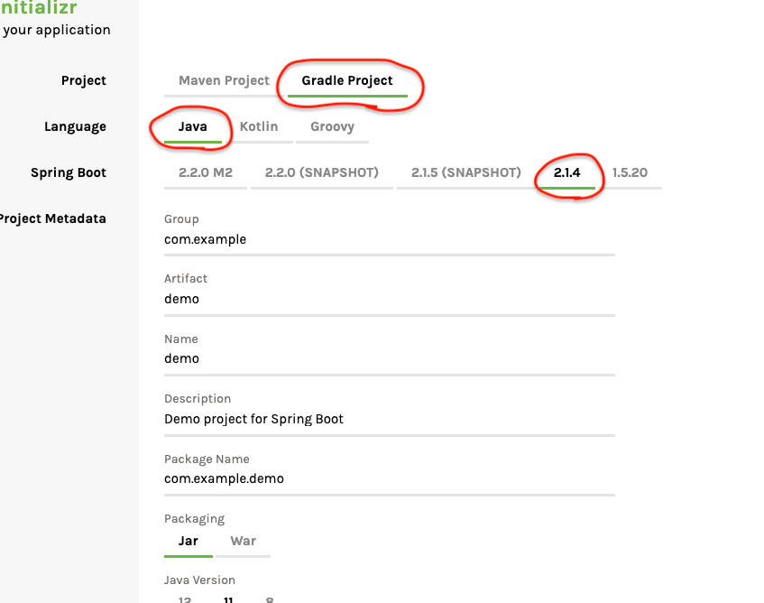
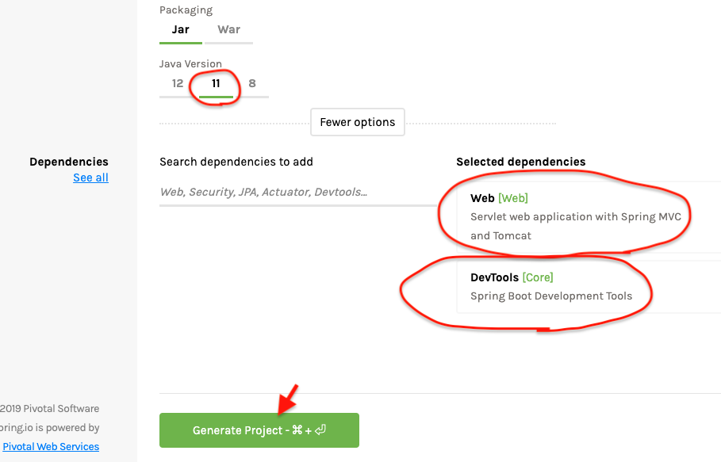
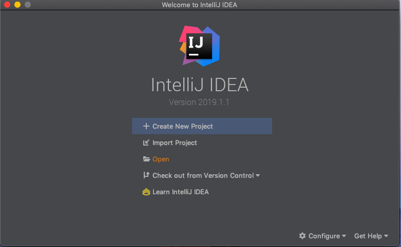
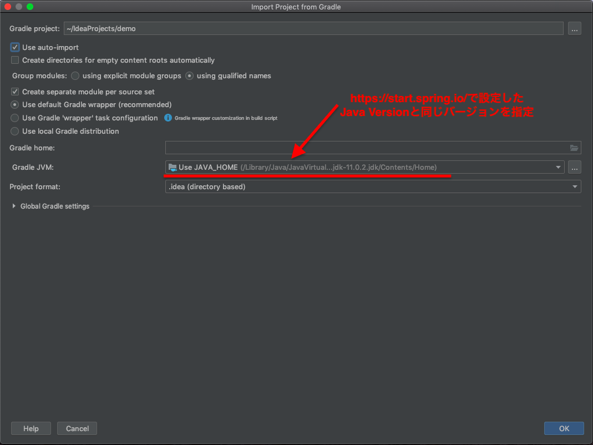
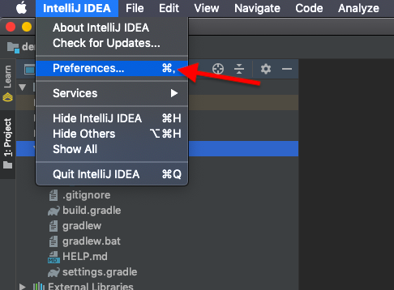
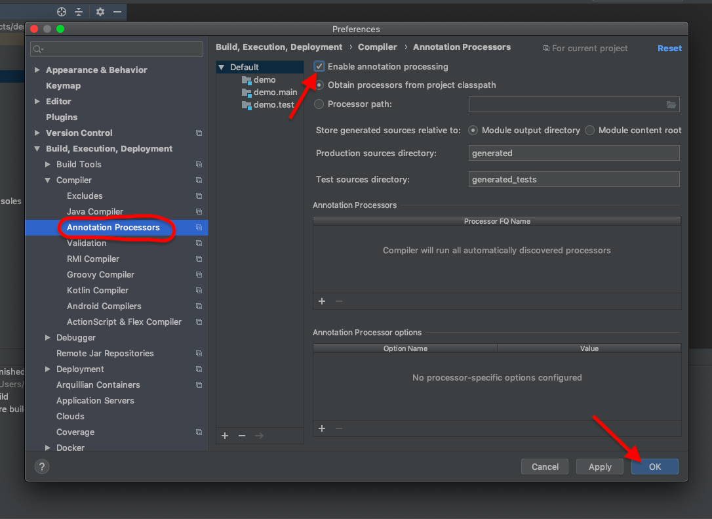
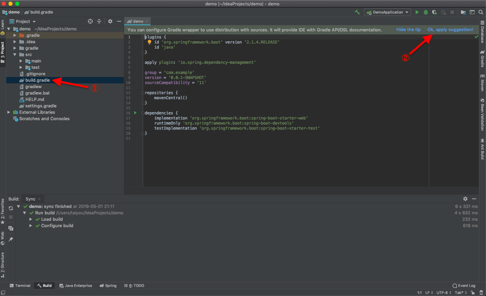
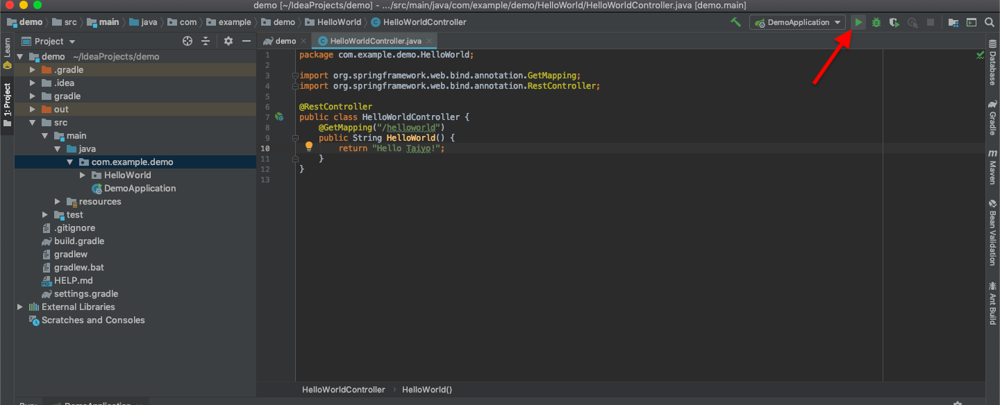

# プロジェクトの作成

<!-- MarkdownTOC -->

- Gradle
    - Gradleをインストール
    - Gradleでプロジェクトを作成
    - プログラムをビルド
    - プログラムの実行
- IntelliJ×Gradle
    - https://start.spring.io/でプロジェクトを生成する
    - IntelliJを起動
    - Javaのバージョン指定
    - アノテーションを有効化
    - Gradleをアップデート
    - Restコントローラの追加
    - 起動
- 「Spring Dev Tools」による開発
- jarファイルの作成

<!-- /MarkdownTOC -->

## Gradle

Gradleを使ったプロジェクト作成について

 - https://gradle.org/

### Gradleをインストール
mac環境でインストール
```bash
brew update
brew install gradle

# バージョンを確認
gradle -v
```

### Gradleでプロジェクトを作成
```bash
mkdir MyBootGApp
cd MyBootGApp

# Gradleの初期化
gradle init
```
これで、フォルダの中にGradleが必要とするファイル類が作成される。ただし、プログラム関係(Javaのソースコードファイルなど)は一切ありません。いわば「Gradleを使うための入れ物の部分」だけができた状態です。

```bash
.
├── build.gradle      # Gradleのビルドファイル。このファイルの中に、ビルドに関する情報や実行する処理が記述されている。
├── gradle            # Gradle本体が使用するファイル類が保存される.開発者がこれらのフォルダを利用することはほとんどない
├── gradlew           # Gradle実行のバッチファイル
├── gradlew.bat       # Gradle実行のバッチファイル
└── settings.gradle   # Gradleの設定情報を記述する
```
これらのファイルの中でも重要なのは、`build.gradle`です。この<strong>ビルドファイル</strong>をいかに作成していくかが、Gradle活用のポイントとなります。

### プログラムをビルド
```bash
cd ~/path/to/MyBootGApp
gradle build
```
これでプログラムがビルドされ、JARファイルにパッケージ化されます。パッケージは、「target」フォルダを作成し、その中に「libs」フォルダを用意して、そこに保存されます。

### プログラムの実行
作成されたjarファイルをそのままjavaコマンドで実行するだけ。
```bash
java -jar build/libs/MyBootGApp-0.0.1-SNAPSHOT.jar
```

---
## IntelliJ×Gradle

### https://start.spring.io/でプロジェクトを生成する

https://start.spring.io/

にアクセスし、下記のように項目を入力する。





 - 「Generate Project」をクリックし、zipファイルをダウンロード
 - ダウンロードしたzipファイルをワークスペース(`~/IdeaProjects`)へ移動させ、解凍

```bash
.
├── build
├── build.gradle    # Gradleのビルドファイル。このファイルの中に、ビルドに関する情報や実行する処理が記述されている。
├── gradle          # Gradleが使用するフォルダ。普段いじらない。
├── gradlew         # Gradle実行のバッチファイル
├── gradlew.bat     # Gradle実行のバッチファイル
├── settings.gradle # Gradleの設定情報を記述する
└── src             # ソースコードがまとめられている「src」フォルダ
    ├── main
    │   ├── java    # 「main」フォルダの中の「java」フォルダへのショートカット
    │   └── resources  # 「main」フォルダ内の「resources」フォルダへのショートカット
    └── test
        ├── java    # 「test」フォルダ内の「java」フォルダへのショートカット
        └── resources
```

### IntelliJを起動
「Open」もしくは「Import Project」を選択



### Javaのバージョン指定



### アノテーションを有効化





### Gradleをアップデート



### Restコントローラの追加

 - 「`com.example.demo`」配下に「`HelloWorld`」パッケージを追加し、その配下に「`HelloWorldController.java`」を作成する

```java
package com.example.demo.HelloWorld;

import org.springframework.web.bind.annotation.GetMapping;
import org.springframework.web.bind.annotation.RestController;

@RestController
public class HelloWorldController {
    @GetMapping("/helloworld")
    public String HelloWorld() {
        return "Hello Taiyo!";
    }
}
```

### 起動



起動できたら、`localhost:8080/helloworld`にアクセス。

---
## 「Spring Dev Tools」による開発
https://qiita.com/sekainohsan/items/cc998596def1cc250a5c

に沿って設定したのち、再度Runする。すると以降は、変更が反映されます。


---
## jarファイルの作成


