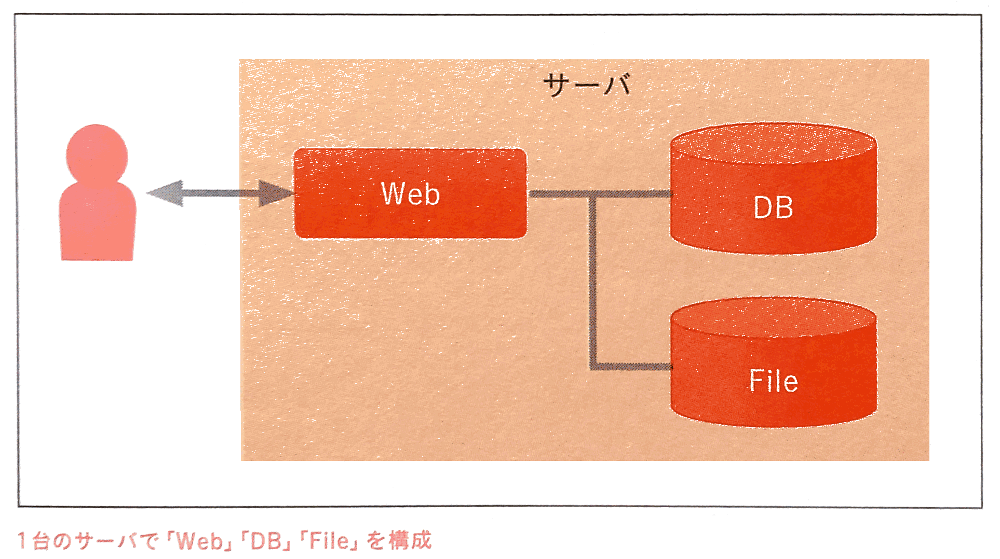
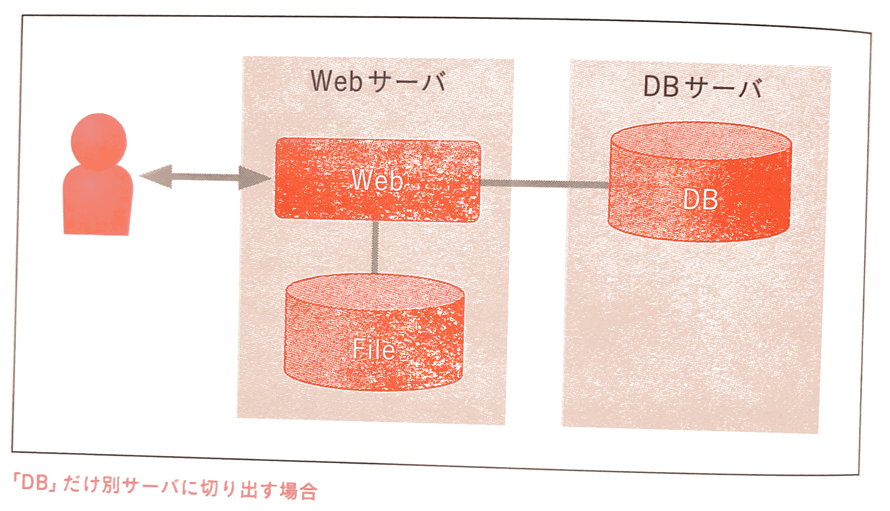
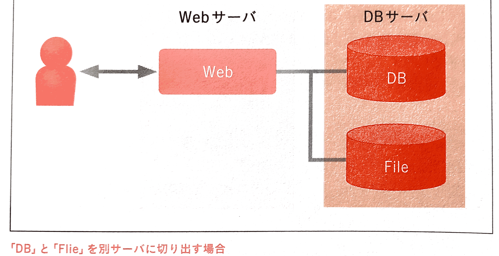
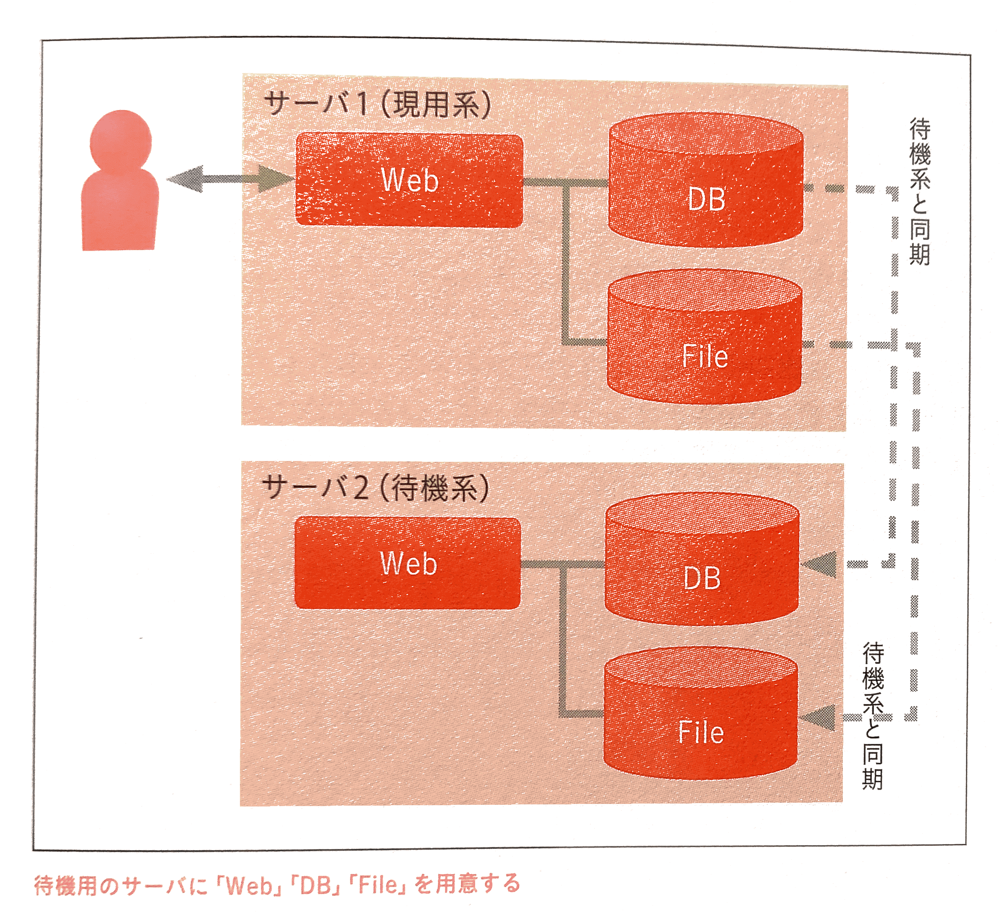
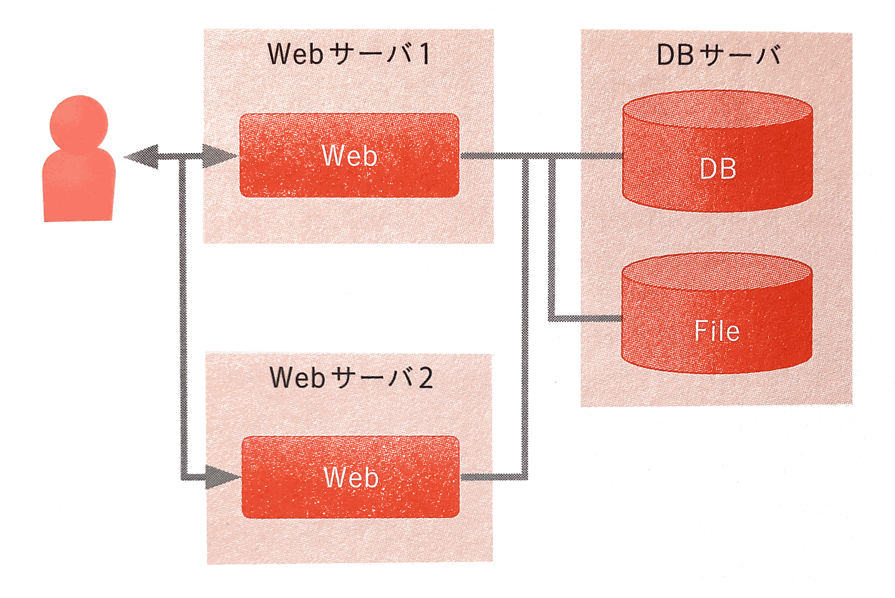
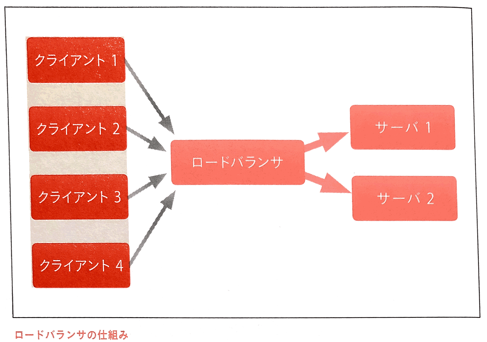

# Webサービスのサーバ構成ベストプラクティス

## 基本的な構成

Webサービスを提供するのに必要となるロール(役割)は次の通りです。

 - **「Web」**
 	- クライアントとの接続
 	- データ転送
 	- 静的データ配信/中継/生成
 	- アプリケーションロジック
 - **「DB」**
 	- データベースの稼働
 	- データベースのデータの保持
 - **「File」**
 	- ファイル形式のデータの保持
 	- 画像やプログラムのファイルそのものなどを保持

### フルスタックを1台のシステムで構成する
一台のシステムで、上記のロールを分けた場合の構成図

#### システム構成変更の基礎
1台のシステムから構成を変更する場合、構成変更にはいくつかの典型的なパターンがある。

| 手法 | 目的 | 内容 |
|:----|:-----|:----|
| 冗長化 | 冗長性向上 | 同じ機能・役割の機器を複数用意し、単一機器の故障の影響でシステム全体に及ばないようにすることでシステム全体の可用性を高める |
| 機能分割 | 処理能力向上 | １台で複数機能を提供している場合、サーバを機能ごとに用意することで１台あたりの処理負荷を小さくしシステム全体としての性能を向上させる |
| スケールアップ | 処理能力向上 | 構成を変更せずサーバの性能そのものを向上させることで、システム全体としての性能を向上させる |
| スケールアウト | 処理能力向上 | 同じ機能・役割の機器を複数用意し処理を分担することで、システム全体としての性能を向上させる | 

### パターン1) Webサーバ×1, DBサーバ×1 構成[機能分割]
1台でサーバスペックが足りなくなったときに、それを解決するために採用することが多い。

「DB」だけ切り出す場合と「DB」と「File」を切り出す場合がある。

### パターン2) Webサーバ×2 構成[冗長化]
この構成は、冗長性を高めるために採用することが多い。サーバ1の方(**現用系**)に何らかの問題があった場合に、代わりにサーバ2の方(**待機系**)を利用する方法。

現用系・待機系の切り替え方法

 - 物理サーバの場合、LANケーブルを差し替える(数時間)
 - DNSを書き換える(数分~数時間)
 - 待機系のIPアドレスを手動で書き換える(数分~数時間)
 - 待機系のIPアドレスを自動で書き換えるプロダクトを導入する(数秒~数分)
 - 他にもロードバンラサを別途用意する

前提条件として、「DB」と「File」は何らかの方法でデータを同期しておく必要がある。

同期方式として完全同期と非同期などのバリエーションがある

 - 完全同期 : パフォーマンスが上がりづらい
 - 非同期 : パフォーマンスが上がりやすいが、非同期ならではのズレに注意が必要

### パターン3) Webサーバ×2, DBサーバ×1構成[冗長化][機能分割][スケールアウト]
この構成はパターン1をやっても「Web」 側の性能問題が解決できない場合に採用することが多い。

 - 「Web」はシステム挙動を逐一計算して処理する必要があり、ユーザ数に応じて処理量が増えやすい箇所になる
 - → そこで、「Web」と「DB」を別のサーバとすることで分業させて、サーバリソース圧迫による性能低下を回避しつつ、「Web」でサーバを複数台使うことでシステム全体の性能を向上させる
 - サーバが2台ないとさばけないほどアクセス数が多い場合、2台構成だと、1台故障し切り離したら結局処理能力不足になってしまうので、可用性の観点では問題がある

### パターン4) Webサーバ×2, DBサーバ×2構成[冗長化][機能分割][スケールアウト]
この構成では、「Web」の冗長化と負荷分散、「DB」の冗長化ができる。

 - 待機系の「DB」に対して参照SQLを発行しデータを取得することは可能だが、負荷的に意味がないし可用性が下がるのでやめたほうがよい
 - 現用系だけでさばききれないなら「File」を別サーバに分ける、待機「DB」(Slave)を3台以上用意するなどの対策をしたほうがよい

---
## 負荷分散(ロードバランシング)の基礎知識
### ロードバランシングの2つの種類

ロードバランシングの目的は**負荷分散**です。冗長化の役割も果たすことがある。

ロードバランシングの主な実現方法

 - ロードバンラサを使う
 - DNSラウンドロビンを使う

> #### ロードバランサの仕組み
>
> ロードバンラサはサーバ側(受け側)に負荷分散の仕組みを用意する。ロードバランサは以下の2つのものがある。
> 
> - ハードウェアのもの
> - ソフトウェア実装のもの

ロードバランサ側でアクセスされるごとに振り分け先を変えて、以下のように1人からの大量アクセスでも分散することができる。

### ロードバランサと振り分け先の接続方式
ロードバランサは大きく

 - L4-NAT
 - L4-DSR
 - L7

の3種類がある。

### ロードバランサでの振り分け先の決定方式
