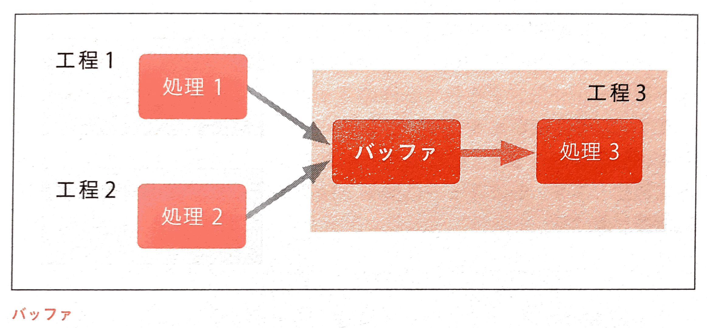
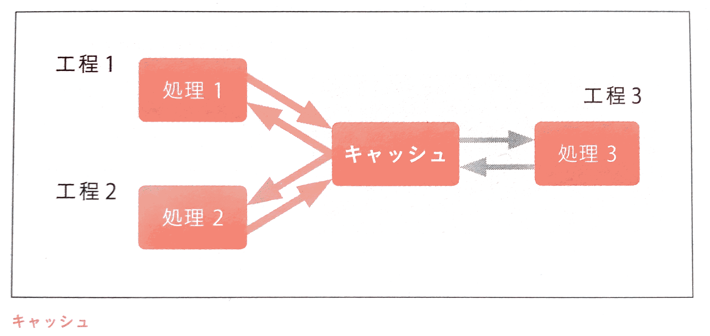
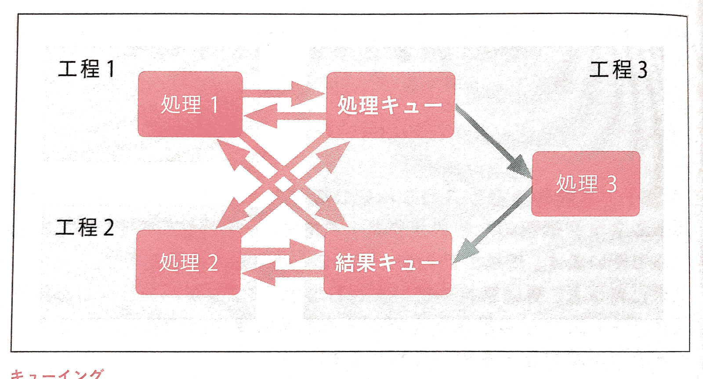

# インフラ技術の基礎知識

## 性能とデータに関する基礎知識
性能とデータに関して、全般的に意識しておくべきこと
### 「ACID」を意識する

 - **Atomicity**(原子性) : 原子性がないと、一連の処理として実行したい操作Aと操作Bについて、AかBのどちらかしか実行されない状態が発生し、処理が中途半端になってしまう。
 - **Consistency**(一貫性) : 一貫性がないと、操作の途中の状態が見えるようになってしまう。
 - **Isolation**(独立性) : 独立性がないと、一連の処理として順番に実行したい操作1と操作2について、1→2の順番が守られず、他のトランザクションから処理中の内容も見えてしまう。
 	- 独立性がある場合は、1→2の順番が守られ、かつ他のトランザクションからは「1も2も実施されていない」か「1と2が順番に両方実施済み」かのいずれかの状態しか見えないようになる。
 - **Durability**(永続性) : 永続性がないと、処理が完了したのにデータが保存されていないという事態が発生する

※トランザクション : データを操作する単位

上記全てを完全に満たそうとすると性能が出ないので、以下2種類のテクニックが発達してきた。

 1. 全てを満たしたまま、性能を上げるテクニック
 2. 一部を満たせないことを許容し、リスクをとって性能を上げるテクニック

### ロックと排他処理
ロックと排他処理は、ACIDを守るためのテクニック。ある処理がリソースを使用しているときには、他の処理がそのリソースを使用できないようにすること。

### バッファ
**処理を効率化しボトルネックを緩和する**ためのテクニック。

 - バッファ : 後工程の処理を効率化するためにデータを一時的にためておく仕組み
 - ディスクやネットワークのI/O(入出力)は、細かく大量の処理をするよりも、ある程度のデータ量がたまってから一気に処理する方が処理効率がよいため、バッファにある程度ためてから一気に処理することがほとんど

### キャッシュ
ボトルネック緩和のためのテクニック。

 - キャッシュ : 処理の結果を一時的にためておく仕組み
 	- 要は結果の使いまわし
 	- アプリケーションの処理結果やディスクから読み込んだデータ取得結果や、DBから読み込んだデータ取得結果などを使い回す
 - キャッシュの破棄を厳密にしなければならない場合もあれば、ある程度緩やかでよい場合もある

### キューイング
ボトルネック緩和のためのテクニック。

 - キューイング : 処理を登録しておく仕組み
 - ボトルネックに引きずられて全体のキャパシティを落とさないために使う
 	1. 処理を依頼する側は、処理キューに処理依頼を登録したところで次の処理に移る
 	2. 処理結果は結果キューに登録されるものを定期的に確認
 - 処理キューに登録し結果を待たずに次の処理に移る非同期性が肝

---
## 冗長化の仕組み
冗長化の実装の種類と注意点
### データの整合性をとるための方法

冗長化した場合の注意点としては、**データの実体が複数存在することになるので、どのデータが正なのか、最新なのかをきちんと管理し、また複数のデータがきちんと整合している状態を保たねばならない**。

データ冗長化の種類

 - **Shared Disk方式** : ストレージを共有する
 - **Shared Nothing方式** : ストレージを共有しない

Shared Disk方式は文字通り1つのストレージを共有する。

Shared Nothing方式の場合は、ストレージ間で通信してデータの整合性をとっている。これをレプリケーション(Replication)と呼ぶ。

 - レプリケーションのデータ送信元 : **Master**(マスター)
 - データ受信側 : **Slave**(スレーブ)

Multi-Master(マルチ・マスター)といって相互にマスターとスレーブの役割を持たせる方式もあるが、トレブルが多くなりがちなのであまり使わない。

 - 同期型のレプリケーションはオーバーヘッドが大きい(同期処理に伴うパフォーマンスの低下の程度が大きい)が、確実
 - 非同期型のレプリケーションだとデータ損失があるかもしれないが、パフォーマンス劣化は少ない

RDBMS(リレーショナルデータベース管理システム)を使う場合、MySQLやPostgreSQLは標準で非同期レプリケーションに対応しているのでよく使われる。

### フェイルオーバーに関する注意点
StandbyだったものがActiveになることを「**昇格**」と呼び、この一連の動作を「**failover(フェイルオーバー)**」と呼ぶ。

---
## 暗号化とハッシュ化
