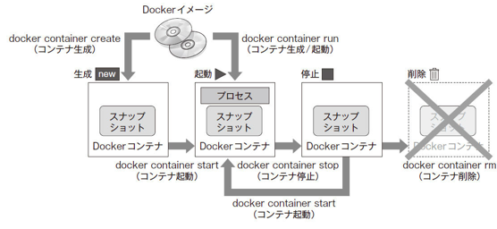

# Dockerコンテナの生成/起動/停止

<!-- MarkdownTOC -->

- コンテナ生成\(`dcoker container create`\)
- コンテナ起動\(`docker container start`\)
- コンテナ生成&起動\(`docker container run`\)
- 稼働コンテナの一覧表示\(`docker container ls`\)
- コンテナの稼働確認\(`docker container stats`\)
- コンテナ削除\(`docker container rm`\)
- コンテナ中断/再開\(`docker container pause`/`docker container unpause`\)

<!-- /MarkdownTOC -->




## コンテナ生成(`dcoker container create`)


## コンテナ起動(`docker container start`)


## コンテナ生成&起動(`docker container run`)
```bash
docker container run [オプション] イメージ名[:タグ名] [引数]
```

| オプション | 説明 |
|:----------|:------|
| `--attach`,`-a` | 標準入力/標準出力/標準エラー出力にアタッチする |
| `--cidiffle` | コンテナIDをファイルに出力する |
| `--interactive`,`-i` | コンテナの標準入力を開く |
| `--tty`,`-t` | 端末デバイスを使う |
| `--name <コンテナ名>` | コンテナ名を指定 |

**バックグランド実行**

| オプション | 説明 |
|:---------|:------|
| `--detach`,`-d` | コンテナを生成し、バックグラウンドで実行する |
| `-u <ユーザ名>` | ユーザ名を指定 |
| `--rm` | コンテナ実行完了後にコンテナを自動で削除 |

**ネットワーク設定**

| オプション | 説明 |
|:---------|:------|
| `--add-host <ホスト名>:<IPアドレス> [<ホスト名2>:<IPアドレス2>]` | コンテナの`/etc/hosts`にホスト名とIPアドレスを定義する |
| `--dns <IPアドレス> [<IPアドレス2>]` | コンテナ用のDNSサーバのIPアドレスを指定 |
| `--expose <ポート番号> [<ポート番号2>]` | 指定した範囲のポート番号を割り当てる |
| `--mac-address <MACアドレス>` | コンテナのMACアドレスを指定 |
| `--net=[bridge | none | container:<name | id> | host | NETWORK]` | コンテナのネットワークを指定する |
| `--hostname <ホスト名>`,`-h <ホスト名>` | コンテナ自身のホスト名を指定 |
| `-p <ホストのポート番号>:<コンテナのポート番号>` | ホストとコンテナのポートをマッピング |
| `--link <コンテナ名>:<エイリアス>` | 他のコンテナからアクセスするときの名前 |


**リソースを指定**

| オプション | 説明 |
|:---------|:------|
| `--cpu-shares`,`-c` | CPUの使用の配分(比率) |
| `--memory`,`-m` | 使用するメモリを制限して実行(単位はb,k,m,gのいずれか) |
| `--volume=<ホストのディレクトリ>:<コンテナの>`,`-v` | ホストとコンテナのディレクトリを共有 |


**環境設定**

| オプション | 説明 |
|:---------|:------|
| `-e 環境変数=値` | 環境変数を設定 |
| `-env-file=<ファイルパス>` | 環境変数をファイルから設定 |
| `--read-only=[true | false]` | コンテナのファイルシステムを読み込み専用にする |
| `-w=<作業ディレクトリパス>` | コンテナの作業ディレクトリを指定 |


ex) calコマンドの実行によるカレンダー表示
```bash
docker container run -it --name "test2" centos:7 /bin/cal
```
ex) bashの実行
```bash
docker container run -it --name "test2" centos:7 /bin/bash
```

バックグランド実行例)
```bash
docker container run -d centos:7 /bin/ping localhost
```

ネットワーク設定例) マッピング
```bash
docker container run -d -p 8080:80 nginx
# ホストの8080ポートにアクセスすると、コンテナ上で動作しているNginx(80番ポート)のサービスにアクセスできる
```
ネットワーク設定例) DNSサーバ指定
```bash
docker container run -d --dns 192.168.1.1 nginx
```
ネットワークの設定例) ホスト名とIPアドレス定義
```bash
docker container run -it --add-host test.com:192.168.1.1 centos
# コンテナ内の/etc/hostsにホスト名とIPアドレスが定義されている
```
ネットワークの設定例) ホスト名の設定
```bash
docker container run -it --hostname www.test.com --add-host node1.test.com:192.168.1.1 centos:7
# コンテナ内の/etc/hostsを確認すると、コンテナ自身のホスト名www.test.comとnode1.test.com(192.168.1.1)が定義されているのがわかる
```

リソース設定の例) CPU時間の相対割合とメモリの使用量を指定
```bash
docker container run --cpu-shares=512 --memory=1g centos:7
```

リソース設定の例) ディレクトリの共有
```bash
docker container run -v /Users/hoge/webap:/usr/share/nginx/html nginx
```

## 稼働コンテナの一覧表示(`docker container ls`)
> Docker上で動作するコンテナの稼働状態を確認する

```bash
docker container ls [オプション]
```

| オプション | 説明 |
|:---------|:------|
| `--all`,`-a` | 起動中/停止中も含めてすべてのコンテナを表示する |
| `--filter`,`-f` | 表示するコンテナのフィルタリング |
| `--no-trunc` | 情報を省略しないで表示する |
| `--quiet`,`-q` | コンテナIDのみ表示する |
| `--size`,`-s` | ファイルサイズの表示 |


## コンテナの稼働確認(`docker container stats`)
```bash
docker container stats [コンテナ識別子]
```

## コンテナ削除(`docker container rm`)
```bash
docker container rm [オプション] コンテナ識別子 [コンテナ識別子2]
```

| オプション | 説明 |
|:---------|:-----|
| `--force`,`-f` | 起動中のコンテナを強制的に削除する |
| `--volumes`,`-v` | 割り当てたボリュームを削除する |

## コンテナ中断/再開(`docker container pause`/`docker container unpause`)
> 起動しているコンテナで動いているプロセスをすべて中断させる

```bash
docker container pause コンテナ識別子
```

> 中断したコンテナを再開させる

```bash
docker container unpause コンテナ識別子
```
