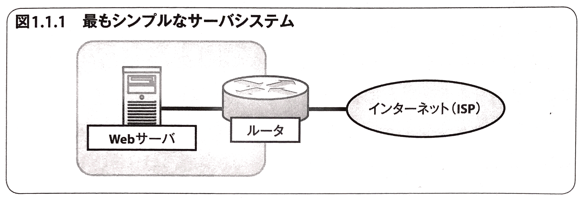
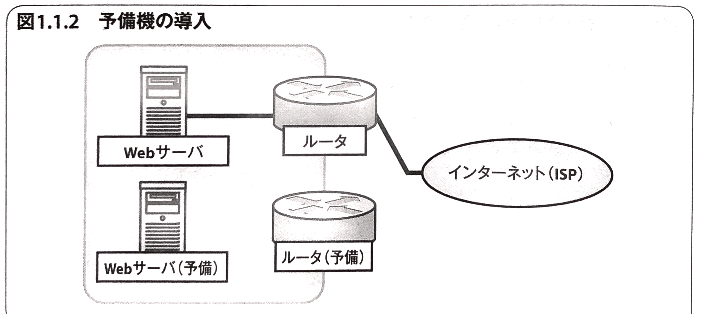
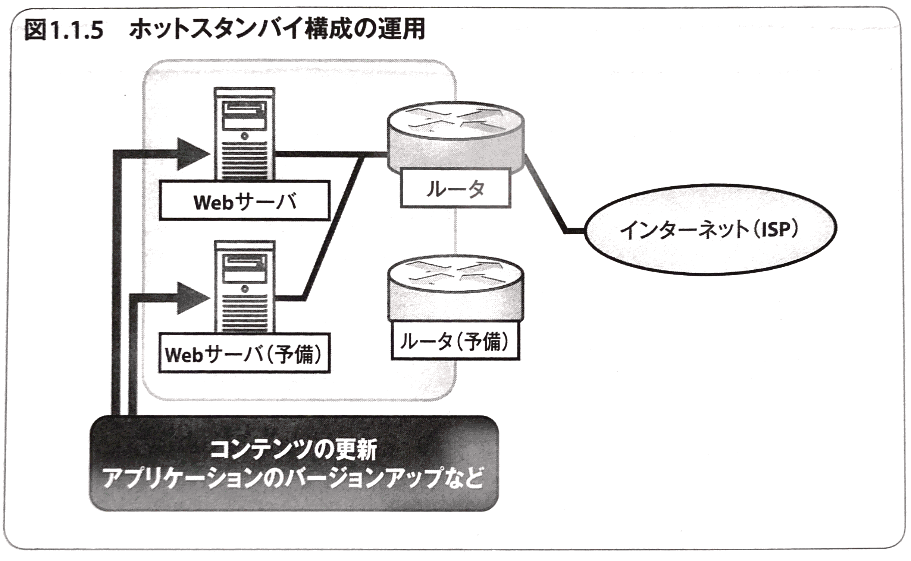
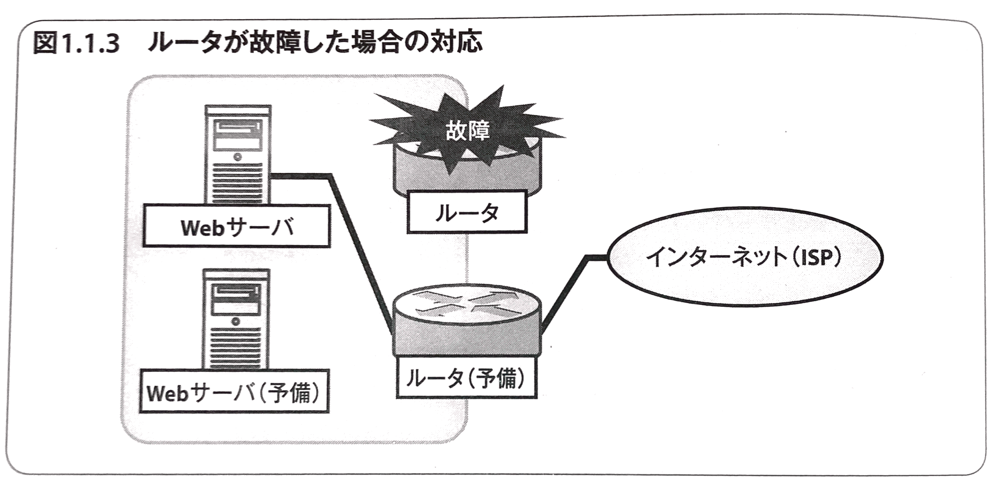
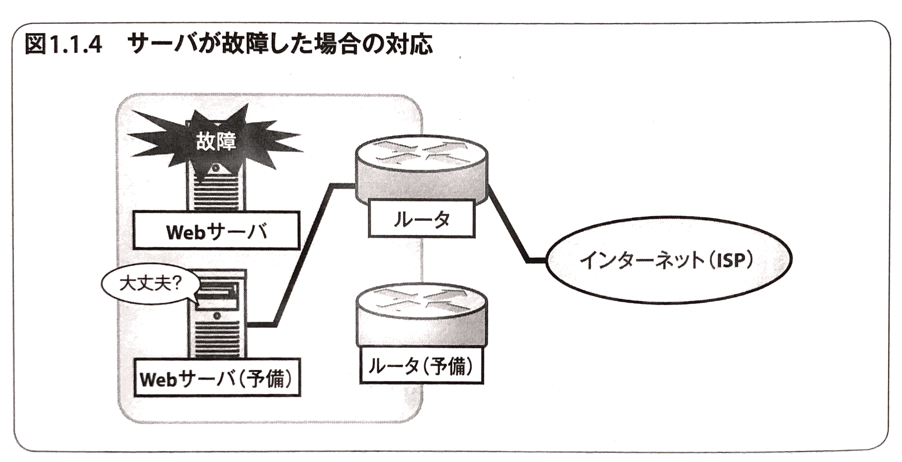
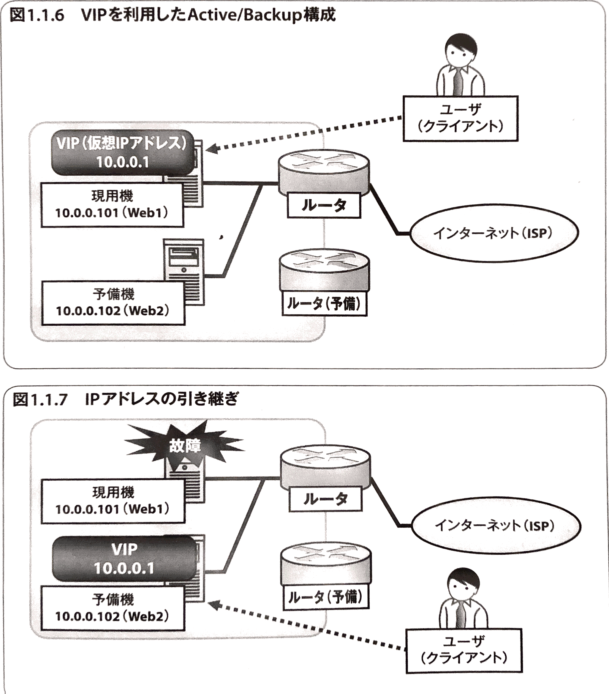

# 冗長化

## 冗長化(Redundancy)とは
**障害が発生しても予備の機材でシステムの機能を継続できるようにすること**

> - 工場や病院などでは、停電などの障害に備えて自家発電装置を持っている
> - 公共の交通機関では、万が一に備えて複数のブレーキ系統を持っている

システムを冗長化させるためには、以下のステップを実践する

 1. 障害を**想定**する
 2. 障害に備えて予備の機材を**準備**する
 3. 障害が発生した際に予備の機材に切り替えられる運用体制を**整備**する

<table>
	<tr>
		<th>冗長化ステップ</th>
		<th>説明</th>
	</tr>
	<tr>
		<td>1.障害を<b>想定</b>する</td>
		<td>
			

				次のようなシンプルな構成で考えてみる。 
				
				上記のシステムで発生しうる障害は以下のようなものが考えられる。
				<ul>
					<li>ルータが故障してサービスが停止する</li>
					<li>サーバが故障してサービスが停止する</li>
				</ul>
			

		</td>
	</tr>
	<tr>
		<td>2.障害に備えて 予備の機材を<b>準備</b>する</td>
		<td>
			

				先ほどの例に予備機を追加したのが以下の図である。 
				 
				ここではまだ、予備のルータとサーバはネットワークに接続していない。
			

		</td>
	</tr>
	<tr>
		<td>3. 障害が発生した際に 予備の機材に切り替えられる 運用体制を<b>整備</b>する</td>
		<td>
			運用体制の整備は、
			<ul>
				<li>上記1,2のステップのどこにどのような障害が発生するか</li>
				<li>どのような機器でどう構成するか</li>
			</ul>
			のようなさまざなな対応を考えなければならない。
		</td>
	</tr>
</table>

	<b>冗長化されたシステムでは、</b>「<b>現用機と予備機の構成を常に同じ状態にしておくことが定石</b>」

| 冗長化構成 | 説明 | メリット/デメリット |
|:--------:|:-----|:------------------|
| **コールドスタンバイ** (Cold Standby) | 予備機は**普段使わず**において、現用機が故障したら予備機を接続する運用体制 | 普段電源が入っていない等で使われていないため、障害時のダウンタイムが長くなってしまう |
| **ホットスタンバイ** (Hot Standby) | 両方のサーバを**常に稼働させ**ておき、常に同じ状態に保っておく運用体制 | 即座に切り替えることが可能 |
| **ウォームスタンバイ** (Warm Standby) | 予備機は普段起動させておき、現用機と同じ状態だが切り替えまでに何らかの作業が必要な運用体制 | - |

 - ルータが故障した場合の対応
 	- 冗長化構成 : コールドスタンバイ
 	- 理由 : ルータなどのネットワーク機器であれば、運用中に頻繁に設定を変えることもないでしょうし、蓄積しなければならないデータもほとんどないので、コールドスタンバイが現実的
 	
 - Webサーバが故障した場合の対応
 	- 冗長化構成 : ホットスタンバイ
 	- 理由 : Webサーバの場合、サイトのデータ作成・更新、アプリやOSのバージョンアップなどの変更作業を普段停止している予備機に対して実施し続けるのは、困難。そのため、常に電源を入れておいて、ネットワークに接続しておくのが良い 
 	

## フェイルオーバ(Failover)
> 現用機に障害が発生したときに、自動的に処理を予備機に引き継ぐこと

サーバをファイルオーバするには「**仮想IPアドレス**(Virtual IP Address; VIP)」を設定し、障害発生時に「**IPアドレスの引き継ぎ**」を行う

## ヘルスチェック(Health Check) - 障害を検出する
> 現用機で発生した障害を検出する仕組み

| ヘルスチェックの用途 | 説明 |
|:-----------------:|:-----|
| ICMP監視(レイヤ3) | echoリクエストを投げてリプライが返ってくるかをチェックする 最も簡単で軽いチェック Webサービスがダウンした場合(Apacheが停止した場合など)は検知できない |
| ポート監視(レイヤ4) | TCPで接続を試み、接続できるかどうかをチェック   Webサービスのダウンを検知できる  過負荷状態で応答できなくなっていたり、エラーを返していることは検知できない |
| サービス監視(レイヤ7) | HTTPリクエストを発行し、正常な応答が返ってくるかどうかをチェック  ほとんどの異常を検知できる   場合によってはサーバに負荷をかけてしまうこともある |

---
# Webサーバの冗長化 - ロードバランサ

## ロードバランサ(Load Balancer;負荷分散機)とは
> 1つのIPアドレスに対するリクエストを複数のサーバへ分散させることができる

